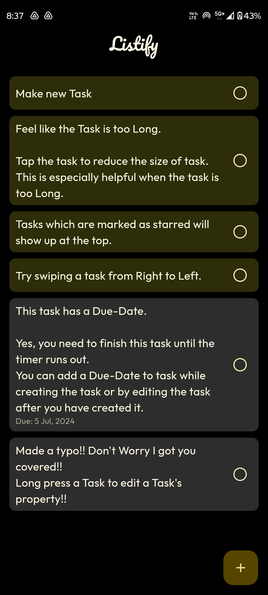
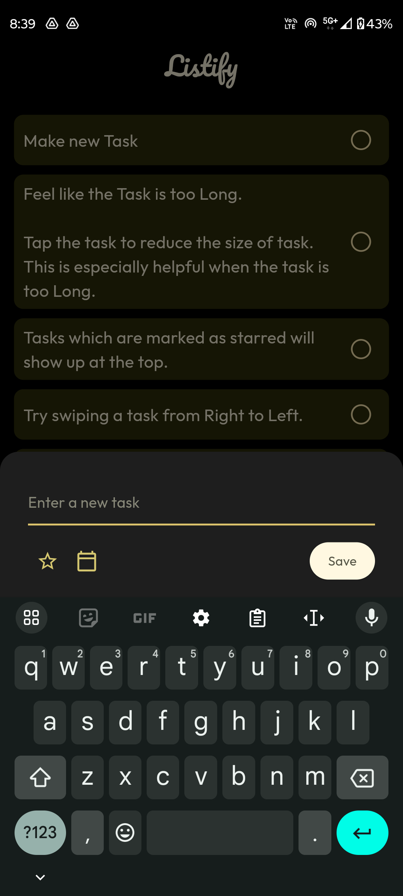
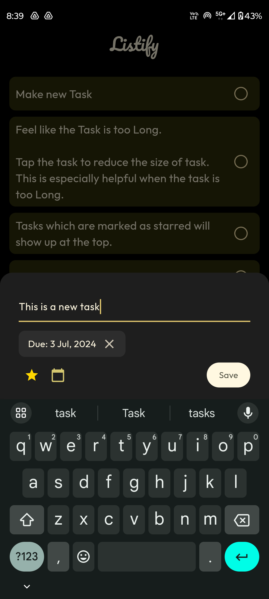
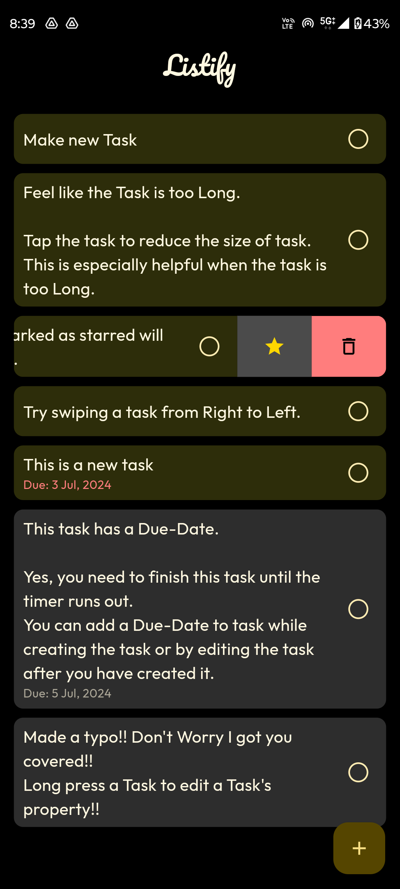
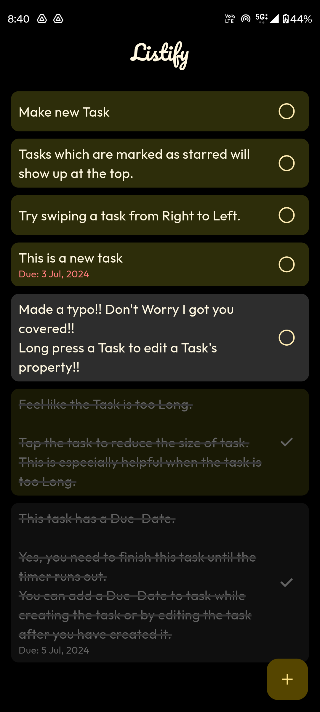

# Listify-ToDo-App

A simple to-do app with a minimalistic user interface made with flutter.

### You can:

- Add new tasks
- Make tasks as favorites and they will show up on top
- Add tasks with a Due-Date
- Delete tasks
- Edit existing tasks

### Preview images of the application

    
    
<ul id='images-list' style="list-style:none;padding:5px;display:flex;flex-direction:column;justify-content:center;align-items:center;">
    <li></li>
    <li><b>HomePage</b></li>
    <li></li>
    <li><b>TaskInputField</b></li>
    <li></li>
    <li><b>TaskEnteredScreen</b></li>
    <li></li>
    <li><b>SlidableTasks</b></li>
    <li></li>
    <li><b>CompletedTasks</b></li>
</ul>

### Google-Drive link to the Application

https://drive.google.com/drive/folders/1KBwyaRK56zdwanZG4aFqwL5P0aS9sFdf
